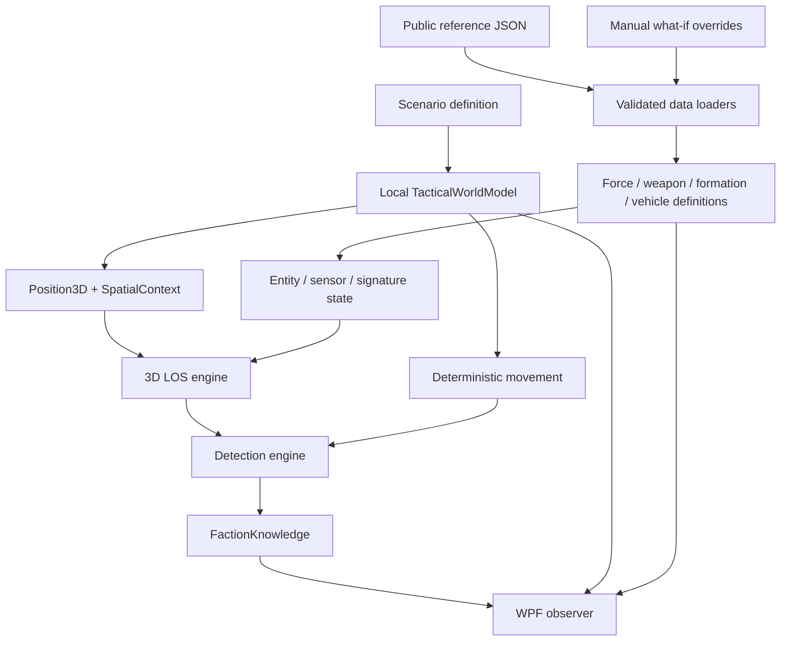

# Architecture

FieldSim uses a deterministic headless core. The visual map, public reference catalogs and scenario definitions are adapters/data around the core rather than sources of hidden simulation truth.

## Layering rules

- `Position3D` is spatial state only; terrain/territory are queried from the world.
- Map artwork is presentation, not elevation/physics truth.
- LOS and detection are separate systems.
- Knowledge belongs to a faction/observer relationship rather than a global `Spotted` flag.
- Vehicle variants are primarily data definitions; broad behavior lives in reusable runtime classes.
- Public nominal fields and synthetic game parameters are explicitly separated.
- Randomness comes only from `DeterministicRng` and is seeded explicitly.
- Unknown public facts remain nullable/unknown.
- Public organization records are separate from scenario deployment state.

## Project responsibilities

- `FieldSim.Core`: time/state, grid references, tactical movement, local XYZ world, LOS, sensors, detection, faction knowledge.
- `FieldSim.Domain`: evidence models, formation hierarchy, vehicle definitions/runtime state and validation.
- `FieldSim.Data`: JSON loading and explicit manual overlays.
- `FieldSim.Scenarios`: deterministic local village worlds and abstract theater scenarios.
- `FieldSim.Desktop`: observer UI only; it queries state and sends explicit simulation commands.
- `FieldSim.Runner`: inspection/batch CLI.
- `FieldSim.Tests`: dependency-free executable regression checks.
